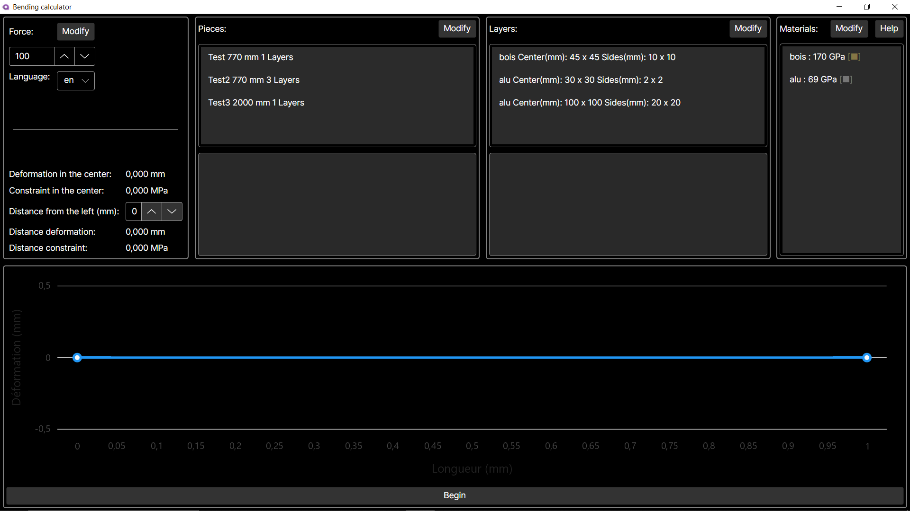

## Bending Calculator

## Description
The application is made to help the bending calculations for composite materials. In the application you can create:
- Materials
- Layers
- Pieces

and assemble them to make the piece you desire. You can then launch the calculation and get the results in a graph.

## Visuals

## Installation
The installation is easy you can go in the release page: https://github.com/stany24/Flexion/releases and download the executable for your os, currently only windows and linux are supported.

## Usage
You could use this application to predict the bending of your skis, by cutting your ski in half and measuring the different layer inside. Then you can insert the data in the software to get the result.

## Support
If you have bug to report the best way is to create an issue here:https://github.com/stany24/Flexion/issues/new.

If you need some help there is an in-app help juste hit the Help button, if you still need help you can contact me on GitHub.

## Roadmap
There are no clear roadmap, we improve the project as it goes and with the help of and expert, The development is coming along with the creation and the improvement of the machine.

## Contributing
If you want to contribute to the project you can make a pull request, and we will review it. Keep your commits simple and focused on one thing.

## Authors and acknowledgment
Dimitri Benoit co-creator of the project.

Gabriel Raymondaz co-creator of the project.

Gouvernon Stan co-creator of the project.

Christophe  Germiquet expert when creating the project.

Laurent Rapillard expert during the national contest.

## License
Boost Software License 1.0 (BSL-1.0)

Permission is hereby granted, free of charge, to any person or organization obtaining a copy of the software and accompanying documentation covered by this license (the "Software") to use, reproduce, display, distribute, execute, and transmit the Software, and to prepare derivative works of the Software, and to permit third-parties to whom the Software is furnished to do so, all subject to the following:

The copyright notices in the Software and this entire statement, including the above license grant, this restriction and the following disclaimer, must be included in all copies of the Software, in whole or in part, and all derivative works of the Software, unless such copies or derivative works are solely in the form of machine-executable object code generated by a source language processor.

THE SOFTWARE IS PROVIDED "AS IS", WITHOUT WARRANTY OF ANY KIND, EXPRESS OR IMPLIED, INCLUDING BUT NOT LIMITED TO THE WARRANTIES OF MERCHANTABILITY, FITNESS FOR A PARTICULAR PURPOSE, TITLE AND NON-INFRINGEMENT. IN NO EVENT SHALL THE COPYRIGHT HOLDERS OR ANYONE DISTRIBUTING THE SOFTWARE BE LIABLE FOR ANY DAMAGES OR OTHER LIABILITY, WHETHER IN CONTRACT, TORT OR OTHERWISE, ARISING FROM, OUT OF OR IN CONNECTION WITH THE SOFTWARE OR THE USE OR OTHER DEALINGS IN THE SOFTWARE.

## Project status
The project is being worked on and is not yet finished, we improve it as we use it and discover bugs and new features we need.
